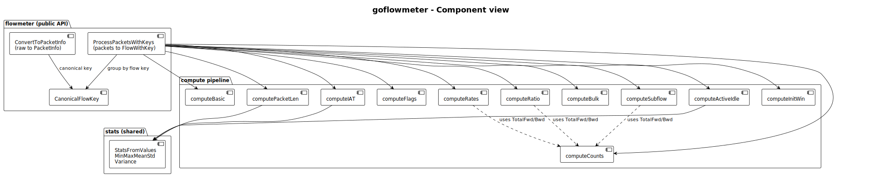
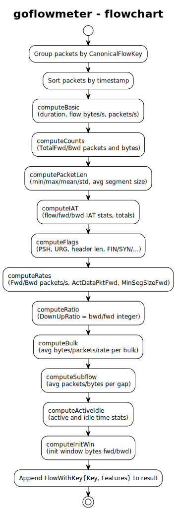
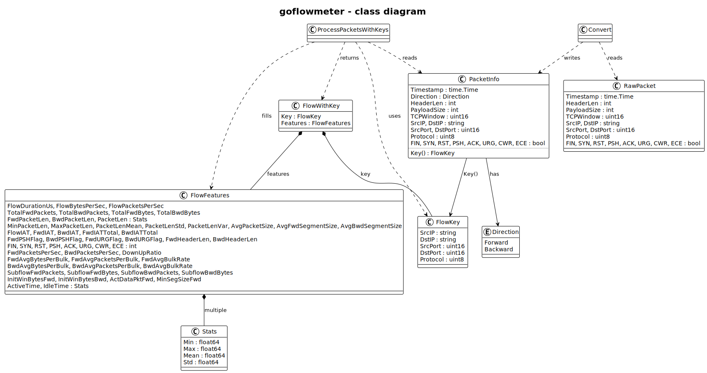

# flowmeter

This flowmeter extracts CICFlowMeter-style flow features in Go.

It is designed to be used as a plug-in: the caller provides packets (e.g. per time window from PCAP), and the flowmeter returns one feature
vector per flow. 

No PCAP path is used inside this module.

**API:** `ProcessPacketsWithKeys(packets []PacketInfo) []FlowWithKey` -
each element has `Key` (5-tuple) and `Features` (flow feature vector).

### Design

[](docs/component_view.svg)

[](docs/flowchart.svg)

[](docs/sequence_diagram.svg)

[](docs/class_diagram.svg)


### Converter (PCAP → flowmeter)

The flowmeter does not read PCAP. To go from a PCAP file to feature vectors:

1. **RawPacket** (in this package) is a packet as seen on the wire:
   same fields as `PacketInfo` but without `Direction`.
   Any reader that can parse IP/TCP or IP/UDP can fill it.
2. **ConvertToPacketInfo(raw []RawPacket) []PacketInfo** assigns direction
   (first-packet rule per flow) and normalizes the 5-tuple so both sides of
   a connection become one flow.
   Call this before `ProcessPacketsWithKeys`.
3. **PCAP -> RawPacket**: The monolithic reuses its gopacket-based reader
   and provides
   **`readers.PcapToRawPackets(path string) ([]flowmeter.RawPacket, error)`**
   in `monolithic/pkg/utils/readers/pcap_to_raw.go`.
   It reads a PCAP file and returns `[]flowmeter.RawPacket` (IP+TCP/UDP only).
   Pipeline:
   `PcapToRawPackets(path)` -> `flowmeter.ConvertToPacketInfo(raw)` ->
   `flowmeter.ProcessPacketsWithKeys(packets)`.

### Input

- **Type:** `[]PacketInfo`.
  One slice per time window (or per chunk);
  the flowmeter does not open files or streams.
- **Required per packet:** `Timestamp`, `Direction` (Forward/Backward),
  the 5-tuple (`SrcIP`, `DstIP`, `SrcPort`, `DstPort`, `Protocol`),
  `HeaderLen`, and `PayloadSize`.
  Flow byte and packet-length stats use payload only.
  For TCP, also set the flag booleans.
- **Direction:** Forward/backward is not present in the packet on the wire;
  the caller must assign it when building `PacketInfo`.
  To match CICFlowMeter: for each flow (same 5-tuple),
  treat the **first packet by time** as defining the initiator - that packet's
  (`SrcIP`, `SrcPort`) is the "forward" side.
  For every packet in that flow, set `Direction = Forward` if
  (`SrcIP`, `SrcPort`) equals the first packet's (`SrcIP`, `SrcPort`),
  otherwise `Direction = Backward`.
  So forward = same endpoint as the flow's first packet sender;
  backward = the other endpoint.
- **Ordering:** The slice need not be sorted.
  Packets are grouped by flow and sorted by timestamp inside the flowmeter.

### Output

- **Type:** `[]FlowWithKey`.
  One element per flow (distinct 5-tuple);
  each has `Key` (FlowKey) and `Features` (FlowFeatures).
- **Order:** Undefined. The caller should not rely on flow order.
- **Use:** Use `Key` to know which flow each `Features` belongs to;
  aggregate per window (e.g. per `Key.SrcIP`) or feed flow-level rows to ML.

---

## CICFlowMeter compatibility

- **Flow key:** Canonical 5-tuple (smaller IP first, then smaller port)
  so both sides of a connection map to the same flow.
- **Time units:** IAT and Active/Idle times are in **microseconds**;
  duration is `FlowDurationUs` (us).
- **Zero-duration flows** (single packet or identical timestamps):
  Flow bytes/s, flow packets/s, Fwd packets/s, and Bwd packets/s are set to **0**
  to match CIC's `getfPktsPerSecond` / `getbPktsPerSecond`
  (which return 0 when duration <= 0).
- **Aligned with CIC:** Down/Up ratio uses integer division then double;
  subflow divides by #gaps (0 when no gaps);
  flow length stats replicate CIC first-packet double-count and
  `getAvgPacketSize = sum / packetCount`.

---

## Feature List and Modules

| Module | File | Features |
|---|---|---|
| **Basic** | `basic.go` | Flow duration (us)<br>Flow bytes/s<br>Flow packets/s |
| **Counts** | `counts.go` | Total Fwd/Bwd packets<br>Total Fwd/Bwd bytes |
| **Packet length** | `packetlen.go` | Fwd/Bwd/Total packet length (min, max, mean, std)<br>Packet length variance<br>Min/Max packet length<br>Packet length mean/std<br>Avg packet size<br>Avg Fwd/Bwd segment size |
| **IAT** | `iat.go` | Flow/Fwd/Bwd inter-arrival time (min, max, mean, std)<br>Fwd/Bwd IAT total |
| **Flags** | `flags.go` | Fwd/Bwd PSH/URG counts<br>Fwd/Bwd header length<br>FIN/SYN/RST/PSH/ACK/URG/CWR/ECE counts |
| **Rates** | `rates.go` | Fwd/Bwd packets/s<br>Act data pkt forward<br>Min segment size forward |
| **Ratio** | `ratio.go` | Down/Up ratio (bwd/fwd packet count) |
| **Bulk** | `bulk.go` | Fwd/Bwd avg bytes per bulk<br>Avg packets per bulk<br>Avg bulk rate |
| **Subflow** | `subflow.go` | Subflow Fwd/Bwd packets and bytes (averages)<br>Subflow = segment between gaps >1s |
| **Active/Idle** | `activeidle.go` | Active time and Idle time (min, mean, max, std)<br>Gap >1s = idle boundary |
| **Init window** | `initwin.go` | Init window bytes forward/backward<br>(0 until `PacketInfo` carries TCP window) |

---

## Usage

1. Build `[]PacketInfo` from the packet source
   (e.g. parse PCAP in the caller).
   Each packet must have: timestamp, direction (Forward/Backward),
   5-tuple (`SrcIP`, `DstIP`, `SrcPort`, `DstPort`, `Protocol`),
   `HeaderLen`, and `PayloadSize`;
   for TCP also set the flag booleans as needed.
2. Call `flowmeter.ProcessPacketsWithKeys(packets)` once per time window (or per chunk).
3. Use the returned `[]FlowWithKey` (one per flow; each has Key and Features) for aggregation per window or for analysis.

## Testing

Tests use synthetic `[]PacketInfo` only (no PCAP files). Run:

```bash
go test -v ./...
```
